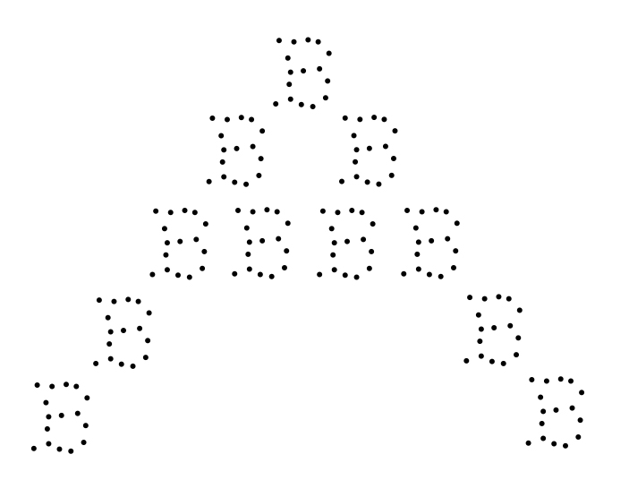
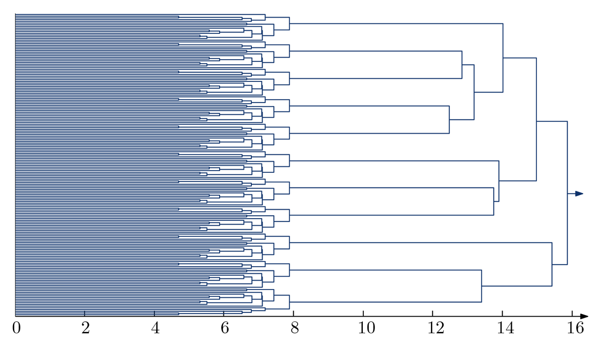

```{r setup, include=FALSE}
knitr::opts_chunk$set(echo = TRUE, cache = FALSE, fig.width = 6, fig.height = 4)
options(width = 55)
library(tidyverse)
library(ggplot2)
library(caret)
library(dplyr)
library(httr)
library(readxl)
library(car)
library(glmnet)
library(kableExtra)
library(pls)
```

# Introduction

Modeling with *unsupervised learning* forgoes the precise prediction of a measured outcome in order to describe patterns of association among 'input measures': the many observations of a feature space (Hastie et al., 2009). We have only $N$-observations $(x_1, x_2, ... x_N)$ of a random $p$-vector $X$ and we wish to directly infer properties of the joint-probability distribution $Pr(X)$. "Cluster analysis attempts to find multiple convex regions of the X-space that contain modes of Pr(X)" (Hastie et al., 2009, pg. *xi*). In essence, we are attempting to see whether $Pr(X)$ can be represented by simpler densities which represent distinct types of constituent observations of $X$. This can be conceived at an elementary level as 'analyzing the variance' of $X_{Np}$, evaluating association without regard to predicting an outcome.

Hierarchical clustering does not require the titular, initializing '$k$' of the $K$-means algorithm, nor an initializing *guess* as to centroids of clusters. *Divisive* hierarchical clustering is based on a chosen measure of *dissimilarity* among pairwise observations. These pairwise 'dissimilarities' are the basis for the disjunction of groups of observations: clusters. This, in turn, is a modular description of one part of an emergent hierarchy.

#### **Visual Data Example**



An example given by Steve Oudot concerning the problem of the scale of data: this image might be described as "one *A* made of 11 *B*'s " or "176 points". A single-linkage agglomerative hierarchical clustering is revealing as to relevant scales:



Each visual point in the image occupies its own cluster at the lowest scale (from about 0 to 5), each $B$ is a cluster at the middle level, and the final level above the last merge is the entire $A$ (in the divisive context, one might suppose the first split represents the two halves or legs of the $A$). The hierarchy of scale, or of some innate linear hierarchy, is well represented by hierarchical clustering. Indeed this is a key benefit of hierarchical clustering compared to $K$-Means clustering. $K$-means requires a $k$ number of clusters to be specified and initial cluster centers to be assigned, to which the algorithm is sensitive: as $k$ is changed the clusters change in arbitrary ways, whereas hierarchical clustering does not require either of these. $K$-means does not provide any linear ordering of cluster objects, whereas this is emergent property of the clustering hierarchy (Hastie et al., 2009, pg. 514). Hierarchical clustering is usefully applied for naturally grouped data, especially where a taxonomic structure may be recognizable.

## Background

Divisive or 'top-down' clustering algorithms have, by the past, been studied less extensively than bottom-up or agglomerative clustering (Hastie et al., 2009, pg. 486). Both types of algorithm ***divide a data set** into a sequence of **nested** partitions* (Gan, 2007, pg. 109). They both are also subject to some of the same drawbacks:

-   data points which were split at an early phase will not be reallocated later
-   various dissimilarity measures lead to differing hierarchies
-   a hierarchy may be established where there is none inherent to the data

Yet a major forthcoming advantage of divisive hierarchical methods is that they may be parametrized to partition the data into a restricted number of clusters, allowing for user specification. There are two general types of divisive methods:

(1) A monothetic method splits data based on the presence/absence of a specified attribute

(2) A polythetic method splits data based on the values of all (many) attributes.

Moreover, divisive hierarchical clustering is *monotone*. At each level (depending on the definition of said 'level'), the subclusters being formed must have a smaller level than the parent cluster.

The totality of data, a single cluster composed of $n$-objects, is gradually split at each lower level into smaller clusters. Each cluster's "internal" dissimilarity diminishes, while the total number of clusters increases, following some criteria. A final hierarchy partitions each individual observation in its own, isolated 'cluster' at the lowest level, entirely 'similar' to itself. This divisive hierarchy then is formed in $n-1$ (potential) steps, with $2^{|n|-1}-1$ non-trivial possibilities to split data into two, a very large number of possible partitions. It would seem that finding an 'optimal' bipartition is NP-hard (Gan, 2007).

# A. DIANA - Divisive Hierarchical Clustering

Commonly known by its moniker 'DIANA' in the field data analytics, this popular divisive hierarchical cluster algorithm proceeds in such a manner: a series of successive splits operated over the cluster of maximal diameter at each given step. This continues until step $n-1$ at which each observation or object is its own cluster, but also allows for a $k$ number of clusters to be specified at which to stop clustering.

In DIANA, cluster diameter is defined as the largest dissimilarity between any of two objects in that cluster. Let $C$ be a cluster of data (even the 'total' cluster of a given data set). The diameter of $C$ is obtained from: $$
diam(C)=\max_{\textbf{x,y}\in C}d(\textbf{x, y})
$$ where $d$ is a specified distance function. (The diameter is further used to represent dendrogrammatic 'heights', the change in internal dissimilarity among clusters.).

Let $A$ and $B$ be the clusters split from $C$, where $A\cup B=C$ and $A \cap B = \emptyset$. DIANA is initialized by letting $A=C$ and $B = \{\}$. The algorithm iteratively 'chisels' $A$ and forms $B$: removing points from $A$ and adding them to $B$ from the cluster $C$ with the greatest internal dissimilarity (diameter), with $C\geq 2$. The first iteration identifies a point $p_1$ if it maximizes the following function:\

$$
D(\textbf{x}, A\setminus\{\textbf{x}\}) = \dfrac{1}{|A-1|} \sum_{\textbf{y}\in A, \textbf{y} \neq \textbf{x}}{d(\textbf{x}, \textbf{y})}
$$

This is the sum of all pairwise distances divided by the cardinality of the initializing cluster less one. Here $d$ is a specified measure of distance and vectors $\textbf{x}$ and $\textbf{y}$ are either samples (their components are the measure for each feature) or features (components are the expressions of each feature in a sample). This can be understood as manner of finding the *average dissimilarity of* $p_1$ to all other points in its cluster, the maximizing point. This point is then removed from $A$ and placed in $B$:

$$
A_{new} = A_{old} \setminus \{\textbf{x}_1\} \\
B_{new} = B_{old} \cup \{\textbf{x}_1\}
$$

The next phase of the algorithm identifies point(s) $p_2$ to $p_n$ by maximizing a slightly modified version of the dissimilarity function:

$$
D(\textbf{x}, A \setminus \{\textbf{x}\}) - D(\textbf{x}, B ) = 
\dfrac{1}{|A-1|} \sum_{\textbf{y}\in A, \textbf{y} \neq \textbf{x}}{d(\textbf{x}, \textbf{y})} 
-\dfrac{1}{|B|} \sum_{\textbf{z}\in B}{d(\textbf{x}, \textbf{z})}
$$

Iterating among all pairs, the difference of the dissimilarity values for a point $p_2$ over clusters $A$, $B$ may be positive or negative. If a point maximizes this function and this maximal value is positive, the point is split into the other cluster. If the maximal value is negative or $0$, the algorithm ends, and the division of $C$ into $A$ and $B$ is complete. There exist some variations on this basic model, employing some maximization of dissimilarity.

Common distance measures include:

\
- *Euclidean:* square distance between two vectors (2-norm)

*-Maximum:* maximum distance between two components of $\textbf{x}$ and $\textbf{y}$ (supremum norm)

\-*Manhattan* or "Taxi": absolute distance across features between two vectors (1-norm)

\-*Minkowski: the* $p$-norm, that is the $p^{th}$ root of the sum of the $p^{th}$ powers of the differences of the components

\-*Canberra:* essentially the *Manhattan* distance normalized by sum:$\sum{(|x_i-y_i|/|x_i+y_i|)}$ , where zero-terms are omitted from the summation. It can be more sensitive to small differences than the *Manhattan* distance.

The 'pair-wise' character of the dissimilarity computation leads to the object known as the distance matrix. Consider the following example calculated with euclidean distances.

```{r distance_matrix_example_1, eval=T, echo=T}

set.seed(1234)

# synthetic data
normal_x <- rnorm(5, mean = 3, sd = 1) |>  round() |>  as.vector()
normal_y <- rnorm(5, mean = 3, sd = 2) |>  round() |>  as.vector()

normal_data <- data.frame(x = normal_x, y = normal_y)

ggplot(normal_data, aes(x = x, y = y)) +
  geom_point(size=2.5) +
  labs(title = "Two-dimensional Data", x = "X", y = "Y") +
  coord_cartesian(xlim = c(0, 5), ylim = c(0, 5))
```

```{r distance_matrix_example_2, eval=T, echo=T}

# Pairwise Euclidean distances into a matrix

n_points <- nrow(normal_data)

distance_matrix <- matrix(0, nrow = n_points, ncol = n_points)

#pairwise Euclidean distances
for (i in 1:n_points) {
  for (j in 1:n_points) {
    distance_matrix[i, j] <- sqrt(sum((normal_data[i, ] - normal_data[j, ])^2))
  }
}

rownames(distance_matrix) <- paste0('Point ', c("a","b","c","d","e"))
colnames(distance_matrix) <- rownames(distance_matrix)


distance_table <- kable(distance_matrix, format = "html", digits = 2) %>%
  kable_styling(full_width = F)

distance_table <- add_header_above(distance_table, 
                                   header = c("Distance Matrix" = ncol(distance_matrix)+1))

distance_table
```

This is the object over which divisive hierarchical algorithms iterate.

## **DIANA in R**

The `cluster` library contains the function `diana()`:

```{r function_intro, echo=T, eval=F}
diana(x, diss = inherits(x, "dist"), metric = "euclidean", stand = FALSE,
      stop.at.k = FALSE,
      keep.diss = n < 100, keep.data = !diss, trace.lev = 0)
```

**x**: the main argument, representing the data matrix or distance matrix used for clustering.

**diss**: A logical value indicating if x already contains a distance matrix. Defaults to TRUE if x inherits from the "dist" class.

**metric**: The distance metric used for calculating distances between data points. Defaults to "euclidean" (Euclidean distance).

**stand**: A logical value indicating whether to standardize the data before clustering. Defaults to FALSE.

**stop.at.k**: A logical value indicating whether to stop clustering at a specific number of clusters (k). Defaults to FALSE (continues until all data points are in separate clusters). **NOT YET IMPLEMENTED (Instead** we would use something like: `cut_clusters <- cutree( diana_result, k=4)` )

Other very important libraries in clustering are the `dendExtend` and `factoExtra` libraries which include a number of clustering and plotting methods and methods useful to aspects of clustering diagnostics.

## Let's try an example!

A data set containing a rubric of information about the films of Studio Ghibli... this studio famously deploys little-to-no marketing campaigns in the distribution of its films, relying on the excitement and interest of audiences.

```{r dataset_intro, message=FALSE, warning=F, eval=T, echo=T}
library(dendextend)
library(ggplot2)
library(plotly)
library(factoextra)
library(cluster)
library(stats)
library(kableExtra)

# Read the Studio Ghibli dataset from URL
url <- "https://raw.githubusercontent.com/cham24/Math_3190_Final_Project/main/datasets_for_testing/Studio%20Ghibli%20%5Bnew%5D.csv"
data <- read.csv(url, header = TRUE)

# Remove rows with missing values and select specific columns
data_new <- na.omit(data)
data_new <- data[c("Year", "Budget_in_.M", "Revenue_in_.M", "Duration", "Rating.based.on.10.", "Vote..in.kilo.")]

# Rename columns
col_names <- c("Year", "Budget", "Revenue", "Duration", "Rating", "Vote")
colnames(data_new) <- col_names
```

Here we see the very basic example using classic Euclidean distance:

```{r basic_euclidean_diana, warning=F, eval=T, echo=T}

# diana() clustering
  
hc_euclid <- diana(
    x = dist(data_new, method = 'euclidean'),     # x is a distance matrix
    diss = TRUE,                                  # dist() creates a distance matrix
    keep.diss = nrow(data_new) < 100,             # Control distance matrix storage (optional)
    keep.data = FALSE,                            # Avoid keeping original data (optional)
    stop.at.k = FALSE                             # non-default is not yet implemented!
  )

```

The diana() clustered object contains a matrix representing the sequence of clustering, where the negative signs represent the point split from the cluster (\`\$merge\` is a misnomer). In the case of DIANA, the `$merge` matrix is in reverse order of the actual splitting to appear in the dendrogrammatic representation, thus reversing this will supply the order of splits:

```{r diana_merge_sequence, warning=F, eval=T, echo=T}

reversed_merge_matrix <- hc_euclid$merge[ nrow(hc_euclid$merge):1, ]
print(reversed_merge_matrix)

```

-   **Row 1:** `[21, -10]`: In the first step, data points with indices 21 and -10, initially in the same cluster, are separated by moving point 10 into a separate cluster (see dendogram below).

-   **Rows 2-6 :**: Data points in these rows remained in a self-same cluster, relative to dissimilarity in the cluster grouping point 10.

-   **Row 7:** `[-6, -23]`: Clusters with indices -6 and -23 (here simply referring to rows in the `hc_euclid` object) were separated from this cluster and from each other. The process taken can thus be tracked at a step-by-step basis. Further, the heights of splits are also recorded in the `$height` attribute, these measures are what is used to construct the dendogram and can be interpreted as another measure of dissimilarity. As with the `$merge` attribute, the order of splits are presented last-to-first:

```{r height_attribute, eval=T, echo=T}

reversed_height_vector <- hc_euclid$height[ length(hc_euclid$height):1 ]
print(reversed_height_vector)

```

As can be seen, the split involving observation $10$ occurs at a dissimilarity height much greater than others.

A basic dendrogram and banner plot can be directly plotted using plot() with the cluster object:

```{r basic_plot_1, eval=T, echo=T}
  plot(hc_euclid)
```

Banner plots display the hierarchy of clusters, equivalent to a tree where banners plot the diameter of each cluster being split (Kaufman, Rousseeuw (1990)).

Using `cutree()` , the clusters can be restricted, and a new partition will be formed:

```{r clustering_tables, warning=F, eval=T, echo=T}

# Cluster assignments from cutree()
cluster_assignments <- cutree(hc_euclid, k = 4)

print(cluster_assignments)

table(cluster_assignments)

```

# B. DISMEA

This divisive method uses the $k$-means algorithm to subdivide a cluster into two. This method produces an $n$ level hierarchy where $n$ is also the size of the given data set. Similar to DIANA, the algorithm begins with the entire data set as a single cluster $C$ and at each step it splits the cluster with the largest sum of squared distances (SSD). This means that a maximum number of clusters $k_{max}(\leq n)$ is specified in the DISMEA algorithm. (Gan, 2007).

# C. Edwards & Cavalli-Sforza

This hierarchical divisive algorithm splits observations into two groups by maximizing the *between-cluster* sum of squares. The *within-cluster sum of squares* (WSS) divided by the number of points (the variance of the cluster) represents cluster density. This algorithm splits the initial cluster into two by enumerating all possible bipartitions and minimizing the WSS at that split level. In this algorithm, the best partition may not be unique in some cases. Another problem is that the initial computation requires an evaluation of all $2^{n-1}-1$ possible splits

# **Dendrogram**

\
The most common diagnostic measure in hierarchical clustering is arguably the dendrogram visualization. Dendrograms provide a graphical representation of the clustering process, showing how clusters merge or split at each step. They are widely used because they offer intuitive insights into a hierarchical structure of the data and help in determining an optimal number of clusters or meaningful 'levels' of dat.

## RShiny App : Reactive Dendrogram

```{r}
# Dendogram Viewer v.2

library(shiny)
library(shinydashboard)
library(cluster)  

ui <- dashboardPage(
  dashboardHeader(title = "Dendrogram Viewer"),
  dashboardSidebar(
    fileInput("dataFile", "Upload dataset", accept = ".csv"),
    selectInput("numColumns", "Select numeric columns for clustering",
                choices = NULL, selected = NULL, multiple = TRUE),
    selectInput("distanceType", "Select Distance Type",
                choices = c("euclidean", "manhattan", "minkowski", "canberra", "binary", "maximum"), selected = "euclidean"),
    sliderInput("numClusters", "Number of Clusters:", min = 2, max = 10, value = 3),
    actionButton("update", "Update Selection")
  ),
  dashboardBody(
    plotOutput("dendrogramPlot", height = "90vh")  
  )
)

server <- function(input, output, session) {
  data <- reactive({
    inFile <- input$dataFile
    if (is.null(inFile)) {
      return(NULL)
    }
    # df <- 
    read.csv(inFile$datapath, na.strings = c("NA", "na", ""))
    # row.names(df) <- df$Name
    # df[, !(names(df) %in% c("Name"))]  
  })
  
  observe({
    df <- data()
    if (!is.null(df)) {
      updateSelectInput(session, "numColumns", choices = names(df)[sapply(df, is.numeric)])
    }
  })

  output$dendrogramPlot <- renderPlot({
    req(input$update)
    df <- data()
    if (is.null(df) || is.null(input$numColumns)) {
      return()
    }
    clean_data <- df[, input$numColumns]
    clean_data <- apply(clean_data, 2, function(column) {
      if (any(is.na(column))) {
        column[is.na(column)] <- mean(column, na.rm = TRUE)
      }
      return(column)
    })

    dist_matrix <- tryCatch({
      dist(clean_data, method = input$distanceType)
    }, warning = function(w) {
      cat("Warning: ", w$message, "\n")
      return(NULL)
    }, error = function(e) {
      cat("Error: ", e$message, "\n")
      return(NULL)
    })

    if (!is.null(dist_matrix)) {
      diana_clust <- diana(dist_matrix)
      clusters <- cutree(diana_clust, k = input$numClusters)
      plot(diana_clust, labels = df[,1], main = "Dendrogram of Divisive Hierarchical Clustering")
      rect.hclust(as.hclust(diana_clust), k = input$numClusters, border = 2:8)
    }
  })
}

shinyApp(ui, server)
```

# Diagnostic and Remedial Measures

## I. Cophenetic Distance & Correlation

The ***cophenetic correlation coefficient*** is a statistic representing how well a dendrogram preserves the pairwise distances between data points. It is the correlation between the $2^{|n|-1}-1$ pairwise dissimilarities from the proximity matrix evaluated by the algorithm and their corresponding *cophenetic dissimilarities* (or 'distance')derived from the dendogram. The fidelity of a hierarchical clustering solution is assessed by comparing the distances in the original data space with the distances represented by the dendrogram. A high cophenetic correlation indicates that the dendrogram accurately represents the underlying pairwise distances between data points. This, however, is not as well defined, or rather not directly applied, in the divisive case. Rather than merging, clusters are divided based on a splitting criterion. Thus other, alternative measures are also employed such as *intra-cluster variation*, the *silhouette coefficient*, or the *Davies Bouldin* index which compares average intra-cluster varition to the inter-cluster separation.

**(1) Compute the Original Pairwise Distances**: Start by calculating the pairwise distances between all data points in the original dataset using an appropriate distance metric (e.g., Euclidean distance, Manhattan distance, etc.).

**(2) Compute Cophenetic Distances**: For each pair of data points, calculate the cophenetic dissimilarity or distance $c_{ij}$: the height at which the two points are first merged into the same cluster in the dendrogram. This is, in other words, "the intergroup dissimilarity at which observations $i$ and $i'$ are first joined together in the same cluster" (Hastie et al. 2009, pg. 522) in the agglomerative case. In the divisive case, where the nodes represent clusters at each splitting level, their positions are based on the 'distance' or dissimilarity between the clusters formed at each split.

This is considered a "very restrictive" dissimilarity measure as $c_{ij}$ over the observations must contain many 'ties' or links, since only $n-1$ (number of splits) of the total $2^{|n|-1}-1$ dissimilarity values can be distinct (Hastie et al. 2009, pg. 522). For any three dissimilarity values $i, j, k$, they conform to the 'ultrametric inequality':

$$
c_{ij} \leq \max\{c_{ik}, c_{jk}\}
$$

Where, say in Euclidean space, these are points with Euclidean coordinates and the set of interpoint distances form an isosceles triangle for all triples of points with the unequal length no longer than the length of the two equal sides (Hastie et al. 2009, pg. 523). Thus general dissimilarities in arbitrary data sets do not truly resemble the cophenetic dissimilarities and the dendrogram is best understood as a clustering structure imposed by the algorithm.

**(3) Compute Cophenetic Correlation**: Once you have the original pairwise distances and the corresponding cophenetic distances, calculate the correlation coefficient between these two sets of distances.

The cophenetic correlation $c$ is computed using the following formula, the sum of a product of differences divided by its norm:

$$c = \frac{\sum_{i < j}(d_{ij} - \bar{d})(c_{ij} - \bar{c})}{\sqrt{\sum_{i < j}(d_{ij} - \bar{d})^2 \sum_{i < j}(c_{ij} - \bar{c})^2}}$$

Where:

-   $d_{ij}$ is the original pairwise distance between data points $i$ and $j$.

-   $c_{ij}$ is the cophenetic distance between data points $i$ and $j$ in the dendrogram, the height of their splitting node.

-   $\bar{d}$ is the mean of the original pairwise distances.

-   $\bar{c}$ is the mean of the cophenetic distances.

-   The summations are over all pairs of data points $i$ and $j$ with $i$ \< $j$.

The resulting cophenetic correlation coefficient $c$ ranges from -1 to 1, where a value close to 1 indicates high similarity between the original pairwise distances and the distances represented by the dendrogram.

The performance of various distance metrics with a data set may be simply evaluated using this statistic.

```{r cophenetic_cor, echo = T, eval = T, warning=F, message = F}

# List of distance metrics
distance_metrics <- c("euclidean", "maximum", "manhattan", "canberra", "binary", "minkowski")

# Perform divisive hierarchical clustering and calculate cophenetic metrics
diana_results <- lapply(distance_metrics, function(distance_metric) {
  
  # Compute distance matrix
  distance_matrix <- dist(data_new, method = distance_metric)
  
  # Perform diana() clustering
  hc <- diana(
    x = distance_matrix,
    diss = TRUE,
    keep.diss = nrow(data_new) < 100,
    keep.data = FALSE
  )
  
  # Calculate cophenetic distance and correlation
  cophenetic_distance <- cophenetic(as.hclust(hc))
  cophenetic_correlation <- cor(distance_matrix, cophenetic_distance)
  
  # Return a list with clustering object, cophenetic distance, and correlation
  return(list(
    hc = hc,
    cophenetic_distance = cophenetic_distance,
    cophenetic_correlation = cophenetic_correlation
  ))
})

# Find the result with the highest cophenetic correlation
best_index <- which.max( sapply(diana_results, function(result) result$cophenetic_correlation))
best_result <- diana_results[[best_index]]
best_distance_metric <- distance_metrics[best_index]

# Results
cat("Distance metric with highest cophenetic correlation:", best_distance_metric, "\n")
cat("Cophenetic correlation:", best_result$cophenetic_correlation, "\n")

```

Highest Cophenetic correlation is $0.938$ , which is obtained with **euclidean** distance.

This correlation value indicates a strong relationship between the original pairwise distances and the cophenetic distances present in the dendrogrammatic representation.

```{r dendrogram1, echo = T, eval = F, warning=F, message = F}
# Perform divisive hierarchical clustering
best_hc <- diana( dist(data_new, method = "euclidean"))

# Color branches of the dendrogram
best_hc_colored <- color_branches(as.dendrogram(best_hc), k = 5)

# Plot dendrogram
plot(best_hc_colored, main = "Dendrogram obtained by dissimilarity based on euclidean distance")
```

**How to use dendrogram?**

**(1) Visual Inspection:**

-   **Observe the Overall Structure**: Start by examining the overall structure of the dendrogram. Look for patterns of clustering and the hierarchy of clusters.

-   **Check the Branch Lengths**: Longer branches represent greater dissimilarity between clusters. Pay attention to abrupt changes in branch lengths, which may indicate significant differences between clusters.

-   **Identify Cluster Cuts**: Look for natural breaks or clusters where the dendrogram is cut. These cuts represent the division points where clusters are formed.

**(2) Determining the Number of Clusters:**

-   **Horizontal Cuts**: Imagine drawing a horizontal line across the dendrogram. The number of times this line intersects the vertical lines (branches) indicates the number of clusters.

-   **Natural Breaks**: Identify points in the dendrogram where there are large gaps between branches. These points often correspond to natural breaks in the data and suggest the optimal number of clusters.

**(3) Assessing Cluster Sizes:**

-   **Cluster Size Distribution**: Examine the distribution of cluster sizes by looking at the heights of the dendrogram branches. Ensure that the resulting clusters are of reasonable sizes and not overly skewed.

-   **Balanced Clusters**: Ideally, clusters should have approximately equal numbers of data points, but this may vary depending on the nature of the data and the clustering objectives.

**(4) Identifying Inconsistencies:**

-   **Inconsistent Splitting**: Look for instances where clusters are split at varying distances. Inconsistent splitting may indicate suboptimal clustering or noisy data.

-   **Abnormal Patterns**: More apt in the case of agglomerative clustering: watch out for abnormal patterns such as clusters splitting and then merging shortly afterward. These patterns may suggest errors in the clustering process or the presence of outliers.

**(5) Iterative Refinement:**

-   **Experiment with Parameters**: Adjust clustering parameters such as distance metrics and observe the changes in the dendrogram structure.

-   **Compare Results**: Compare dendrograms generated with different parameter settings to identify the most stable and meaningful clustering solution.

```{r dendrogram2, echo = T, eval = T, warning=F, message = F}
# Perform hierarchical clustering with the chosen parameters
best_hc <- diana(dist(data_new, method = "euclidean"))

# Cut the dendrogram to get the clusters
clusters <- cutree(best_hc, k = 3)  
# You can adjust the number of clusters as needed, here we use 3

# Plot the dendrogram with cluster colors
plot(as.dendrogram(best_hc), main = "Dendrogram with euclidean distance",
     xlab = "Observations", ylab = "Height")
rect.hclust(best_hc, k = 3, border = 2:4)  # Highlight clusters
```

```{r cluster_profiles, echo = T, eval = T, warning=F, message = F}

# Cut the dendrogram to get a restricted number clusters
clusters <- cutree(best_hc, k = 3)  # Using 3 clusters

# Combine the original dataframe with the cluster labels
data_clusters <- cbind(data_new, cluster = clusters)
data_clusters

# Count the number of observations in each cluster
cluster_counts <- table(clusters)

# Print the number of observations in each cluster
print("Number of observations in each cluster:")
print(cluster_counts)

# Cluster profiling: calculate summary statistics for each cluster
cluster_profiles <- aggregate(data_clusters[, -7], by = list(cluster = clusters), FUN = mean)
cluster_profiles
```

3 Clusters:

-   Cluster 1 contains **18** observations: 1, 12, 9, 19, 7, 11, 2, 4, 21, 8, 20, 3, 5, 17, 22, 18, 6, 23

-   Cluster 2 contains **1** observations: 10

-   Cluster 3 contains **4** observation: 13, 14, 15, 16

#### Removing outlier

It appears that observation 10 is an outlier as it is the only observation in Cluster 2. From the dendrogram this point significantly differs from the rest of the data, either due to measurement errors or for some other reasons.

We checked the observation 10, which was Spirited Away with a modest budget (\$19.2M) but high revenue (\$395.8M). "Spirited Away" is a renowned and critically acclaimed animated film, so its outlier status might not be due to any inherent issues with the data but rather because of its exceptional success compared to other observations in the dataset.

Removing this outlier allows us to focus on the typical characteristics of the dataset without the influence of such exceptional cases. So we remove this outlier for further analysis.

```{r data_no_outlier, echo = T, eval = T, warning=F, message = F}
# Remove outlier observation (10)
data_no_outlier <- data_new[-10, ]

# Print the dimensions of the new dataframe
print(dim(data_no_outlier))
```

```{r cophenetic_cor_no_outlier, echo = T, eval = T, warning=F, message = F}
# Perform divisive hierarchical clustering and calculate cophenetic metrics

diana_results <- lapply(distance_metrics, function(distance_metric) {
  
  # Compute distance matrix
  distance_matrix2 <- dist(data_no_outlier, method = distance_metric)
  
  # Perform diana() clustering
  hc2 <- diana(
    x = distance_matrix2,
    diss = TRUE,
    keep.diss = nrow(data_no_outlier) < 100,
    keep.data = FALSE
  )
  
  # Calculate cophenetic distance and correlation
  cophenetic_distance2 <- cophenetic(hc2)
  cophenetic_correlation2 <- cor(cophenetic_distance2, distance_matrix2)
  
  # Return a list with clustering object, cophenetic distance, and correlation
  return(list(
    hc = hc2,
    cophenetic_distance = cophenetic_distance2,
    cophenetic_correlation = cophenetic_correlation2
  ))
})

# Find the result with the highest cophenetic correlation
best_index2 <- which.max(sapply(diana_results, function(result) result$cophenetic_correlation))

best_result2 <- diana_results[[best_index2]]

best_distance_metric2 <- distance_metrics[best_index2]

# Print results (optional)
cat("Distance metric with highest cophenetic correlation:", best_distance_metric2, "\n")
cat("Cophenetic correlation:", best_result2$cophenetic_correlation, "\n")
```

Even with the removal of an outlier, the highest Cophenetic correlation achieved is 0.898, obtained with the Euclidean distance metric. While this correlation is slightly lower than the previous highest, it still reflects a strong overall clustering structure in the data

```{r dendrogram_no_outlier, echo = T, eval = T, warning=F, message = F}
# Perform hierarchical clustering with the chosen parameters
best_hc2 <- diana(dist(data_no_outlier, method = "euclidean"))

# we choose 4 clusters based on the natural breaks
clusters2 <- cutree(best_hc2, k = 4)

# Plot the dendrogram with cluster colors
plot(as.dendrogram(best_hc2), main = "Dendrogram with euclidean distance (without outlier)",
     xlab = "Observations", ylab = "Height")
rect.hclust(best_hc2, k = 4, border = 2:8)  # Highlight clusters
```

```{r cluster_profiles2, echo = T, eval = T, warning=F, message = F}
# Perform hierarchical clustering with the chosen parameters
best_hc2 <- diana(dist(data_no_outlier, method = "euclidean"))

# Cut the dendrogram to get the clusters
clusters2 <- cutree(best_hc2, k = 4)  # Set the number of clusters to 4

# Combine the original dataframe with the cluster labels
data_clusters2 <- cbind(data_no_outlier, cluster = clusters2)
data_clusters2
# Count the number of observations in each cluster
cluster_counts2 <- table(clusters2)

# Print the number of observations in each cluster
print("Number of observations in each cluster:")
print(cluster_counts2)

# Cluster profiling: calculate summary statistics for each cluster
cluster_profiles2 <- aggregate(data_clusters2[, -7], by = list(cluster = clusters2), FUN = mean)
cluster_profiles2
```

4 Clusters (without outlier):

-   Cluster 1 contains 16 observations: 1, 12, 9, 19, 7, 11, 2, 4, 21, 8, 20, 3, 5, 17, 22, 18

-   Cluster 2 contains 2 observations: 6, 23

-   Cluster 3 contains 2 observation: 13, 14

-   Cluster 4 contains 2 observation: 15, 16

## **II. Silhouette Coefficient**

The Silhouette Coefficient is a measure of how similar an object is to its own cluster (*cohesion*) compared to other clusters (*separation*). Silhouette Coefficient measures the relative distance between a data point and its own cluster versus neighboring clusters, providing insight into the quality and separation of clusters in a dataset.

It ranges from -1 to 1, where a high value indicates that the object is well matched to its own cluster and poorly matched to neighboring clusters.

How to Compute Silhouette Coefficient?

(1) Compute the average distance from a single data point $i$ to all other points in the same cluster. Let this be denoted as $a_i$​.

(2) For each neighboring cluster (clusters other than the cluster $i$ belongs to), compute the average distance from $i$ to all points in that cluster. Let the minimum of these distances be denoted as $b_i$​.

(3) Compute the silhouette coefficient $s_i$​ for data point $i$ using the formula:

$$
s_i=\frac{b_i - a_i}{max(a_i, b_i)}
$$

-   $s_i​$ represents the Silhouette Coefficient for data point $i$.

-   $a_i$​ represents the average distance from $i$ to all other points in the same cluster.

-   $b_i$​ represents the minimum average distance from $i$ to all points in neighboring clusters.

4.  Repeat steps (1)-(3) for all data points.
5.  Finally, compute the overall Silhouette Coefficient as the mean of all $s_i$​ values.

$\text{Overall Silhouette Coefficient} = \frac{1}{N} \sum_{i=1}^{N} s_i$

-   N is the total number of data points.

```{r silhouette, eval=T, echo=T, warning=F}
library(cluster)

# Compute silhouette scores
sil_scores <- silhouette(clusters2, dist(data_clusters2))
sil_scores
```

```{r silhouette_graph, eval=T, echo=T, warning=F}
library(factoextra)

# Fit hierarchical clustering with the chosen parameters
best_hc2 <- diana(dist(data_no_outlier, method = "euclidean"))
clusters2 <- cutree(best_hc2, k = 4)  # Set the number of clusters to 4

# Create a silhouette plot
silhouette_plot <- fviz_silhouette(
  silhouette(clusters2, dist(data_clusters2[, -ncol(data_clusters2)])),
  geom="bar",
  main="Silhouette Plot for Clusters"
)

# Show the silhouette plot
print(silhouette_plot)
```

The average silhouette width for each cluster provides insights into the quality and separation of the clusters. Here's an observation for each cluster based on the average silhouette width:

**(1) Cluster 1 (16 observations, average silhouette width: 0.52):**

-   This cluster has a moderate average silhouette width, indicating that most observations within this cluster are reasonably well-matched to their own cluster and have some degree of separation from observations in other clusters.

**(2) Cluster 2 (2 observations, average silhouette width: 0.28):**

-   This cluster has a relatively low average silhouette width, suggesting that the observations within this cluster may be less well-defined or have less distinct boundaries compared to observations in other clusters.

**(3) Cluster 3 (2 observation, average silhouette width: 0.60):**

-   This cluster has a moderate to high average silhouette width, indicating good separation and cohesion among its observations. The relatively high silhouette width suggests that the observations within this cluster are well-matched to their own cluster and are distinct from observations in other clusters.

**(4) Cluster 4 (2 observation, average silhouette width: 0.79):**

-   With a high average silhouette width, this cluster demonstrates excellent separation and cohesion among its observations. The high silhouette width indicates that the observations within this cluster are very well-matched to their own cluster and are clearly distinct from observations in other clusters.

## **III. Davies-Bouldin Index**

This internal evaluation scheme compares intra-cluster variation or scatter with inter-cluster separation. A lower index value indicates a better clustering result, yet a 'good value' returned by this index does not necessarily represent a good information representation.

First, we calculate the average distance of feature vectors $X_j$ in an $i^{th}$ cluster from the centroid $A_i$ of said cluster, where $T_i$ is the size of this $i^{th}$ cluster:

$$
S_i = (\dfrac{1}{T_i} \sum_{k=1}^{T_i}||X_j-A_i||_p^q)^{1/q}
$$

Here, if $q=1$ then indeed it is the distance to the centroid, and usually $p=2$ , for a $2$-norm, euclidean distance. Other distance metrics of course may be used in the case of higher-dimensional data.

Then a measure of cluster separation is calculated (with $a_{k,i}$ being the $k_{th}$ element of $A_i$, if the centroid contains $n$ such elements, were $A_i$ an $n$-dimensional centroid):

$$
M_{i,j}=||A_i-Aj||_p=(\sum_{k=1}^{n}|a_{k,i}-a_{k,j}|^p)^{1/p}
$$

Then the Davies-Bouldin conditions define $R_{i,j}$ as a measure of how good or how 'tight' a clustering scheme is by the following :

1.  $R_{i,j} \geq 0$

2.  $R_{i,j}=R_{j,i}$

3.  When $S_j \geq S_k$ and $M_{i,j} = M_{i,k}$ then clustering schemes $R_{i,j} > R_{i,k}$

4.  When $S_j = S_k$ and $M_{i,j} \leq M_{i,k}$ then $R_{i,j} > R_{i,k}$

Where $R_{i,j}$ should be as small so as to account for the separation $M_{i,j}$ among $i^{th}$ and $j^{th}$ clusters, ideally a large value in the denominator. Then a solution that satisfies these conditions is:

$$
R_{i,j}=\dfrac{S_i + S_j}{M_{i,j}}
$$

Which is then used to define $D_i$, a 'worst-case' value :

$$
D_i \equiv \max_{j\neq i}\{R_{i,j}\}
$$

And where $N$ is the number of clusters, the Davies-Bouldin index is:

$$
DB \equiv \dfrac{1}{N} \sum_{i=1}^{N}D_i
$$

The index thus represents an average over all the $i$ clusters. Plotting this against the number of clusters it is calculated over can be a good measure of deciding how many clusters exist, or where to restrict splits. This index can be improved (that is, the value lowered) by increasing inter-cluster separation and intra-cluster cohesion (Davies, 1979).

# Completing Analysis

```{r cluster_description, eval=T, echo=T, warning=FALSE}
cluster_profiles2
```

## Cluster Description

Let's summarize the features of each cluster based on the provided cluster profiles:

**Cluster 1:**

-   Year: Around 1999.5

-   Budget: Approximately \$13.7 million USD

-   Revenue: Around \$44.76 million USD

-   Duration: Average duration of approximately 106.81 minutes

-   Rating: Average rating of about 7.48

-   Vote: Average number of votes around 79.63 thousand

**Cluster 2:**

-   Year: Around 2015.5

-   Budget: Average budget of \$67 million USD

-   Revenue: Average revenue of \$249.5 million USD

-   Duration: Average duration of 112 minutes

-   Rating: Average rating of approximately 7.6

-   Vote: Average number of votes around 106.5 thousand

**Cluster 3:**

-   Year: Around 1988.0

-   Budget: Average budget of \$15.25 million USD

-   Revenue: Average revenue of \$20.76 million USD

-   Duration: Average duration of 87.5 minutes

-   Rating: Average rating of approximately 8.3

-   Vote: Average number of votes around 344.5 thousand

**Cluster 4:**

-   Year: Around 2000.5

-   Budget: Average budget of \$23.75 million USD

-   Revenue: Average revenue of \$215.15 million USD

-   Duration: Average duration of 126.5 minutes

-   Rating: Average rating of approximately 8.25

-   Vote: Average number of votes around 440.5 thousand

# Conclusions

## Strengths:

1.  **Interpretability**: Divisive clustering produces a hierarchical structure of clusters, making it easier to interpret and understand the relationships between clusters at different levels of granularity. This hierarchical representation can provide insights into the natural grouping of data and the hierarchical organization of clusters.

2.  **Flexibility**: Divisive clustering allows for the exploration of clusters at multiple levels of detail. Analysts can start with a single cluster encompassing all data points and recursively divide it into smaller clusters until reaching the desired level of granularity. This flexibility allows for adaptive clustering based on the characteristics of the data and the analytical objectives.

3.  **Scalability**: Divisive clustering can be more computationally efficient than agglomerative clustering, especially for large datasets. Since divisive clustering starts with a single cluster and recursively divides it into smaller clusters, it can be less computationally intensive than agglomerative clustering, which involves pairwise comparisons and merging of clusters.

4.  **Hierarchy Preservation**: Divisive clustering preserves the hierarchical relationships between clusters throughout the clustering process. This hierarchical structure provides additional context and information about the relationships between clusters, which can be useful for downstream analysis tasks such as visualization, interpretation, and pattern discovery.

5.  **Top-Down Exploration**: Divisive clustering allows analysts to perform top-down exploration of the data, starting with a global view of the entire dataset and progressively refining the clustering structure to reveal finer-grained patterns and relationships. This top-down approach can be beneficial for gaining insights into the hierarchical organization of data and identifying clusters at different levels of abstraction.

## Weaknesses:

1.  **Sensitivity to Initial Conditions**: Divisive clustering heavily relies on the initial selection of clusters, which can affect the final clustering results. Depending on the choice of initial cluster seeds, the algorithm may converge to different solutions, leading to variations in the clustering outcome.

2.  **Computational Complexity**: Divisive clustering can be computationally intensive, especially for large datasets. Since it involves recursively dividing clusters into smaller clusters, the algorithm's complexity increases with the number of data points and the depth of the clustering hierarchy. This can make divisive clustering less scalable for very large datasets compared to other clustering methods.

3.  **Dependency on Distance Metric**: The choice of distance metric used in divisive clustering can significantly impact the clustering results. Different distance metrics may lead to different clustering outcomes, making it important to carefully select an appropriate distance measure based on the characteristics of the data and the clustering objectives.

# References

-   Hastie, Trevor, Robert Tibshirani, and Jerome Friedman. The Elements of Statistical Learning: Data Mining, Inference, and Prediction. Second Edition. Springer, 2009.

-   Gan, Guojun, Ma, Chaoqun, Wu, Jianhong. Data Clustering: Theory, Algorithms, and Applications, 7. Hierarchical Clustering Techniques. ASA-SIAM, 2007. ISBN: 978-0-89871-623-8.

-   <https://www.rdocumentation.org/packages/cluster/versions/2.1.6/topics/diana>, website.

-   Oudot, Steve. Persistence Theory: From Quiver Representations to Data Analysis, Introduction. AMS, 2015.

-   A. Kassambara, Practical Guide to Cluster Analysis in R , ch. 9, pages 84-96.

-   Everitt, B. S., Landau, S., Leese, M., & Stahl, D. (2011). Hierarchical clustering. Wiley Interdisciplinary Reviews: Data Mining and Knowledge Discovery, 1(1), 14-23.

-   Murtagh, F. (2011). On ultrametricity, data coding, and computation. Journal of Classification, 28(3), 326-347.

-   Davies, David L., Bouldin, Donald W., (1979). A Cluster Separation Measure. IEEE Transactions on Pattern Analysis and Machine Intelligence. PAMI-1 (2): 224-227.

-   R Development Core Team (2021). R: A language and environment for statistical computing. R Foundation for Statistical Computing.

-   Rousseeuw, P. J. (1987). Silhouettes: A graphical aid to the interpretation and validation of cluster analysis. Journal of Computational and Applied Mathematics, 20, 53-65.

-   Tibshirani, R., Walther, G., & Hastie, T. (2001). Estimating the number of clusters in a data set via the gap statistic. Journal of the Royal Statistical Society: Series B (Statistical Methodology), 63(2), 411-423.

#### Footnote: Agglomerative Clustering R Shiny App

```{r shiny_agglomerative, echo = F, eval = F, message = F}
library(shiny)
library(shinydashboard)
library(stats)

ui <- dashboardPage(
  dashboardHeader(title = "Dendrogram Viewer for Studio Ghibli Dataset"),
  dashboardSidebar(
    fileInput("dataFile", "Upload your Studio Ghibli dataset", accept = ".csv"),
    selectInput("numColumns", "Select numeric columns for clustering",
                choices = NULL, selected = NULL, multiple = TRUE),
    selectInput("distanceType", "Select Distance Type",
                choices = c("euclidean", "maximum", "manhattan", "canberra", "binary", "minkowski"), selected = "euclidean"),
    selectInput("linkageMethod", "Select Linkage Method",
                choices = c("ward.D", "ward.D2", "single", "complete", "average", "mcquitty", "median", "centroid"), selected = "complete"),
    actionButton("update", "Update Selection")
  ),
  dashboardBody(
    plotOutput("dendrogramPlot"),
    verbatimTextOutput("fileInfo")
  )
)

server <- function(input, output, session) {
  data <- reactive({
    inFile <- input$dataFile
    if (is.null(inFile)) {
      return(NULL)
    }
    read.csv(inFile$datapath, na.strings = c("NA", "na", ""))
  })
  
  observe({
    df <- data()
    updateSelectInput(session, "numColumns", choices = names(df)[sapply(df, is.numeric)])
  })

  output$fileInfo <- renderPrint({
    df <- data()
    if (is.null(df)) {
      "No file uploaded."
    } else {
      summary(df)
    }
  })

  output$dendrogramPlot <- renderPlot({
    req(input$update)
    df <- data()
    if (is.null(df) || is.null(input$numColumns)) {
      return()
    }
    clean_data <- df[, input$numColumns]
    clean_data <- apply(clean_data, 2, function(column) {
      if (any(is.na(column))) {
        column[is.na(column)] <- mean(column, na.rm = TRUE)
      }
      return(column)
    })

    dist_matrix <- tryCatch({                      
      dist(clean_data, method = input$distanceType) #dist() method
    }, warning = function(w) {
      cat("Warning: ", w$message, "\n")
      return(NULL)
    }, error = function(e) {
      cat("Error: ", e$message, "\n")
      return(NULL)
    })

    if (!is.null(dist_matrix)) {
      hc <- hclust(dist_matrix, method = input$linkageMethod) 
      #this is specifically for agglomerative
      plot(hc, main = "Dendrogram of Agglomerative Hierarchical Clustering")
    }
  })
}

shinyApp(ui, server)
```

#### Footnote: Divisive Clustering R Shiny App (DIANA)

```{r}
# Dendogram Viewer v.2

library(shiny)
library(shinydashboard)
library(cluster)  

ui <- dashboardPage(
  dashboardHeader(title = "Dendrogram Viewer"),
  dashboardSidebar(
    fileInput("dataFile", "Upload dataset", accept = ".csv"),
    selectInput("numColumns", "Select numeric columns for clustering",
                choices = NULL, selected = NULL, multiple = TRUE),
    selectInput("distanceType", "Select Distance Type",
                choices = c("euclidean", "manhattan", "minkowski", "canberra", "binary", "maximum"), selected = "euclidean"),
    sliderInput("numClusters", "Number of Clusters:", min = 2, max = 10, value = 3),
    actionButton("update", "Update Selection")
  ),
  dashboardBody(
    plotOutput("dendrogramPlot", height = "90vh")  
  )
)

server <- function(input, output, session) {
  data <- reactive({
    inFile <- input$dataFile
    if (is.null(inFile)) {
      return(NULL)
    }
    # df <- 
    read.csv(inFile$datapath, na.strings = c("NA", "na", ""))
    # row.names(df) <- df$Name
    # df[, !(names(df) %in% c("Name"))]  
  })
  
  observe({
    df <- data()
    if (!is.null(df)) {
      updateSelectInput(session, "numColumns", choices = names(df)[sapply(df, is.numeric)])
    }
  })

  output$dendrogramPlot <- renderPlot({
    req(input$update)
    df <- data()
    if (is.null(df) || is.null(input$numColumns)) {
      return()
    }
    clean_data <- df[, input$numColumns]
    clean_data <- apply(clean_data, 2, function(column) {
      if (any(is.na(column))) {
        column[is.na(column)] <- mean(column, na.rm = TRUE)
      }
      return(column)
    })

    dist_matrix <- tryCatch({
      dist(clean_data, method = input$distanceType)
    }, warning = function(w) {
      cat("Warning: ", w$message, "\n")
      return(NULL)
    }, error = function(e) {
      cat("Error: ", e$message, "\n")
      return(NULL)
    })

    if (!is.null(dist_matrix)) {
      diana_clust <- diana(dist_matrix)
      clusters <- cutree(diana_clust, k = input$numClusters)
      plot(diana_clust, labels = df[,1], main = "Dendrogram of Divisive Hierarchical Clustering")
      rect.hclust(as.hclust(diana_clust), k = input$numClusters, border = 2:8)
    }
  })
}

shinyApp(ui, server)
```
